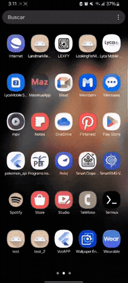
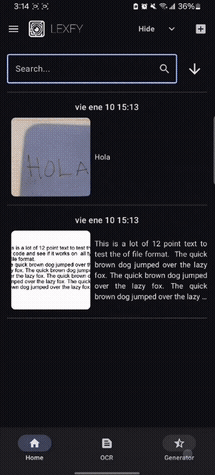

# Welcome to Lexfy 📸✨

[](https://kotlinlang.org/)
[](https://developer.android.com/jetpack/compose)
[](https://www.python.org/)
[](https://firebase.google.com/)

Welcome to the **Lexfy** repository. This is a native Android application that integrates Optical Character Recognition (OCR) and AI-powered image generation into a cohesive platform. It allows users to extract text from physical documents using OCR models such as EasyOCR and GOT-OCR2_0, and generate images from text prompts using Together AI (FLUX.1-schnell) through a conversational chat interface.

---

## 📚 About The Project

| Feature                | Details |
| ---------------------- | ------- |
| 🎯 **Purpose**         | A centralized tool for text extraction from images using OCR models and image generation from text prompts using AI services. |
| ⚙️ **Architecture**     | Client-Server architecture. The Android client communicates via HTTP with a local Python/Flask backend hosting the AI models. |
| 💾 **Data Management** | User authentication, document storage, and chat history synchronization are securely handled via Firebase. |
| 🔄 **Core Operations** | Capture/upload photos for OCR, edit extracted text, prompt image generation, and manage personal document libraries. |

---

## 🚀 Tech Stack

### Android & UI


- **Kotlin & Jetpack Compose:** UI built declaratively with modern navigation and state handling.
- **CameraX:** Used for capturing images directly from the app.
- **OkHttp:** Handles HTTP communication with backend services.

### Backend & AI Models


- **Python & Flask:** Backend server (`finalApp.py`) processes images and prompts.
- **OCR Models:** EasyOCR and GOT-OCR2_0 for text extraction.
- **Image Generation:** Together API using FLUX.1-schnell.

### Cloud Integration

- **Firebase Authentication**
- **Firebase Firestore & Storage**

---

## 🔧 Highlighted Features

| Feature | Description |
|--------|------------|
| **Multi-Model OCR** | Choose between EasyOCR and GOT-OCR2_0. |
| **AI Image Generator** | Chat-based image generation. |
| **Document Management** | Store, edit, and delete OCR results. |
| **Smart Chat History** | Organized by time periods. |

---

## 📸  Demos

### 🔐 Authentication
<p align="center">
  
</p>

### 🧾 OCR (Image → Text)
<p align="center">
  
  
</p>

### 🖼️ Image Generation (Text → Image)
<p align="center">
  
  
</p>

### 📱 UX & Flow
<p align="center">
  
  
</p>

---

## 🛠️ How to Run Locally

### 1. Backend Setup

```bash
git clone https://github.com/MexboxLuis/Lexfy.git
cd Lexfy/app/src/main/java/com/example/yoloapp/ui/model
```

```bash
pip install flask transformers together easyocr
```

Update API key in `config.py`.

```bash
python finalApp.py
```

---

### 2. Android Setup

- Open the project in Android Studio

#### Firebase Configuration
- Create a Firebase project
- Add an Android app in Firebase Console
- Download the google-services.json file
- Place it inside the app/ directory
- Enable:
    - Authentication
    - Firestore Database
    - Storage

#### API Configuration
- Add your Together AI API key in:
  app/src/main/java/com/example/lexfy/ui/model/config.py

#### Run
- Sync Gradle
- Run on emulator or physical device
